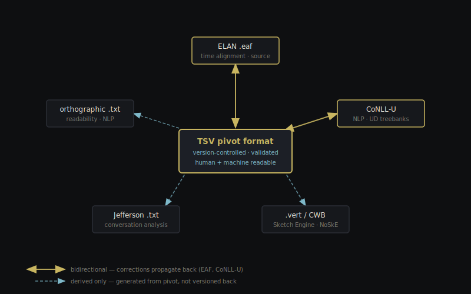
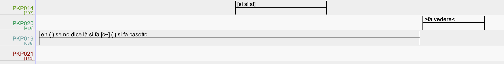

# Git as a Collaborative Environment for Multilayer Spoken Resource Development

---

## Why spoken corpora are hard to manage collaboratively

> "Nothing is, in and of itself, a datum; instead, it is a datum for somebody in some perspective."
>
> — Lehmann (2004), *Data in linguistics*

In Natural Language Processing there is often an unstated assumption about the reality of the datum, spoken data confront us with the fact that every bit of information is in fact a stratification of several levels of interpretation.

---

## Human language is first and foremost spoken

- Spoken interaction is **structurally underrepresented** in language resources
- Growing interest in NLP in modelling language *in interaction* — beyond speech
- Interactional phenomena (overlaps, repairs, backchannels, disfluencies) are often treated as marginal or excluded from downstream formats

*Chrupała (2023) · Dobrovoljc (2022) · Linell (2019)*

---

## The multilayer problem

A spoken corpus is not a text.

It is a **stratification of interpretive layers**:

```
raw audio
  └── pseudonymized audio              [GDPR pipeline]
   |    └── transcription              [ELAN / expert linguist]
   |          └── orthographic form    [normalization scripts]
   |              | └── morphosyntax   [POS tagger + manual revision]
   |              |       └── syntax   [UD treebank annotation]
   |              └──────────────── speech acts / pragmatics   [manual annotation]
   └──────────────────────────────────────────── metadata
```

Each layer: different person · different tool · different time

Downstream exports from these layers:
- **CoNLL-U** — UD treebanks, NLP pipelines
- **Verticalized (.vert / CWB)** — NoSketchEngine, Sketch Engine, ANNIS, corpus query systems
- **Jefferson .txt / CHAT** — interactional analysis, CLAN
- **TEI-ISO 24624** — archiving and exchange

---

## KIParla: a running example

A large (~2M token) corpus of spontaneous spoken Italian

- Started in **2016**
- Built around **modularity**: new modules added with compatible metadata and transcription conventions

```
fieldwork (many people)
    ↓
ELAN transcription  (.eaf XML)
    ↓
expert revision + pseudonymization  (one person)
    ↓
[morphosyntactic annotation  (POS tagger + manual revision)]
    ↓
linearized exports
    ├── Jefferson .txt /             [interactional analysis]
    ├── orthographic .txt            [readability, downstream NLP]
    ├── CoNLL-U                      [UD treebanks, NLP pipelines]
    └── verticalized .vert           [NoSketchEngine, Sketch Engine]
```

*Mauri et al. (2019) · Pannitto et al. (2025)*

**The deeper problem**: many of the derived formats, tools, and pipelines were not designed with spoken interaction in mind.

They do not model:
- the **speaker** as a social agent producing situated language
- the **interactional setting** — who is talking to whom, under what circumstances
- **spoken-language specifics** — overlap, repair, prosody, turn-taking, disfluency

They were built for monological linear text, then retrofitted for spoken language and interaction.

---

## From pipeline to pivot

**Problems with the current pipeline**:

- The pipeline is a *one-way street* — it works like a cascade from transcription to downstream layers. When you work downstream, it's hard to swim upstream
- Validation is *not enforced* — annotation errors only surface when someone notices them, and it's hard to propagate corrections
- At this scale, and with a growing corpus, consistency *cannot be maintained manually* — automatic pipelines are needed
- Each undocumented shortcut, implicit modeling choice, and ad hoc format migration accumulates as **technical and conceptual debt** — making future transformations, collaboration, and reuse increasingly fragile

The linear model treats **ELAN** as the authoritative source. Every derived format is a dead end.

We argue for the introduction of a **pivot model**, which replaces the pipeline with a single maintained representation at the centre:



In the case of KIParla, the pivot is a **verticalized, pseudo-tokenized TSV** — one token per row, enriched with lexical, prosodic, interactional, and alignment features. From it, all formats are reproducibly derived by conversion scripts.

Crucially, the architecture is **bidirectional**: corrections applied at the pivot level propagate to all derived formats and vice versa (to some extent), without breaking annotation on the rest of the resource.

For this to work, the pivot format must satisfy four requirements:

- **Version-controlled** — every change is a commit; full history is preserved
- **Validated at ingestion** — well-formedness constraints enforced before any format is generated
- **Diff-able and human-readable** — inspectable with a text editor or spreadsheet, no specialist tool required
- **Extensible** — new annotation layers are added as columns, without restructuring existing data

*Pannitto & Mauri (2025)*

---

## What an .eaf file looks like

In ELAN, these three utterances appear **side by side** on a shared timeline:



> PKP019: `eh (.) se no dice là si fa [c~] (.) si fa casotto` ← short pauses, interrupted speech
>
> PKP014: `[sì sì sì]`  ← overlaps with PKP019
>
> PKP020: `>fa vedere<`  ← fast paced speech

In the .eaf XML, they live **3000+ lines apart**:

```xml
<!-- line 4630 — PKP014 -->
<ALIGNABLE_ANNOTATION ANNOTATION_ID="a1262"
    TIME_SLOT_REF1="ts2522" TIME_SLOT_REF2="ts2523">
  <ANNOTATION_VALUE>[sì sì sì]</ANNOTATION_VALUE>
</ALIGNABLE_ANNOTATION>

<!-- line 5337 — PKP020 -->
<ALIGNABLE_ANNOTATION ANNOTATION_ID="a179"
    TIME_SLOT_REF1="ts356" TIME_SLOT_REF2="ts357">
  <ANNOTATION_VALUE>&gt;fa vedere&lt;</ANNOTATION_VALUE>
</ALIGNABLE_ANNOTATION>

<!-- line 7669 — PKP019 -->
<ALIGNABLE_ANNOTATION ANNOTATION_ID="a177"
    TIME_SLOT_REF1="ts352" TIME_SLOT_REF2="ts353">
  <ANNOTATION_VALUE>eh (.) se no dice là si fa [c~] (.) si fa casotto</ANNOTATION_VALUE>
</ALIGNABLE_ANNOTATION>
```

- Temporal overlap is **not encoded** — only recoverable by cross-referencing `ts` IDs
- Different levels are mixed: it's not easy to decouple Jefferson notation from transcription
- Additional annotation layers are **external or tool-dependent**
- No path to add morphosyntax, prosody, or speech acts without breaking the format

---

## The invisible cost of infrastructure

> Language Resources projects often struggle not because of analytical complexity,
> but because of **fragile data workflows**, undocumented transformations,
> and ad hoc collaboration practices.

Infrastructure work is invisible — until it breaks. When it does, the cost is:

- **Information loss**: transformations that cannot be reconstructed
- **Misalignment between layers**: each format drifts independently
- **Unintelligible archives**: corpora that become opaque artifacts rather than reusable research objects

The standard response is to delegate all of this to a single technical expert.
This creates its own risk: when that person leaves, the infrastructure becomes unmaintainable.

> The alternative is **distributed computational literacy**

shared understanding of version control, transformation logic, and documentation practices across the whole team.

Not turning linguists into software engineers, but ensuring no one is left unable to navigate the systems
that sustain their own research.

---

## Why a new format?

Spoken language research is characterised **not by a lack of standards, but by the coexistence of partially incompatible ones**,
each optimised for a specific stage of the data lifecycle.

| Format              | Strength                                     | Limitation                              |
| ------------------- | -------------------------------------------- | --------------------------------------- |
| ELAN / .eaf         | Time alignment, interactional detail         | Tool-dependent, hard to diff            |
| CHAT                | Transcription conventions                    | Not designed for large-scale annotation |
| TEI-ISO 24624       | Exchange and preservation                    | Rarely used as working format           |
| CoNLL-U             | NLP pipelines, UD treebanks                  | Loses interactional structure           |
| .vert / CWB         | Corpus query (NoSketchEngine, Sketch Engine) | Flat, no layer hierarchy                |
| ISO 24617-2 (SemAF) | Speech act / dialogue act annotation         | Complex, low adoption                   |

---

## FAIR data vs FAIR processes

> "Interoperability is not achieved through adherence to formats and standards,
> but through the **alignment of curatorial practices**."
>
> — Pannitto & Mauri (2025)

- **FAIR** principles (Findable, Accessible, Interoperable, Reusable) are usually applied to *data products*
- But for living corpora, what matters is whether the **process** is FAIR
- A static release can be FAIR; an evolving corpus needs FAIR *workflows*

---

## Corpora as living artefacts

> "Dataset curation increasingly resembles a form of **continuous development**,
> rather than a linear production pipeline culminating in a static release."
>
> — Pannitto & Mauri (2025)

New data are added · Errors are corrected · Formats evolve · New reuse scenarios emerge

→ This requires **versioning**, **traceability**, and **reversibility** built into the workflow itself, and software engineering already has mature tools for exactly this.

---

## The DevOps analogy

**DevOps** (**Dev**elopment + **Op**erations) is a set of practices from software engineering that breaks down the traditional wall between the people who *write* code and the people who *deploy and maintain* it.

The combined workflow treats development as a *continuous, collaborative, and automated* process.

> every change is tracked, every build is reproducible, and quality is enforced automatically before anything reaches production.

| Software development | Corpus development                     |
| -------------------- | -------------------------------------- |
| Codebase             | Annotated corpus                       |
| Feature branch       | Annotator's working copy               |
| Code review          | Annotation adjudication                |
| CI/CD pipeline       | Validation + format conversion scripts |
| Release tag          | Corpus version (e.g. v1.1.0)           |
| Issue tracker        | Annotation guideline discussion        |

*Steiner (2017) — "A DevOps manifesto for speech corpus management"*

---

## The answer already exists

Software engineers faced the same problems decades ago (distributed teams, evolving artifacts, the need to track every change and recover from every mistake) and built tools to solve them:

- **Git** — version control: every change is a commit, every state is recoverable
- **GitHub / GitLab** — collaboration platforms: review, discussion, and automation built in
- **CI/CD** — automated pipelines: validation and conversion run on every commit, not manually

> We do not need to build new infrastructure.
> We need to apply existing infrastructure to a new domain.